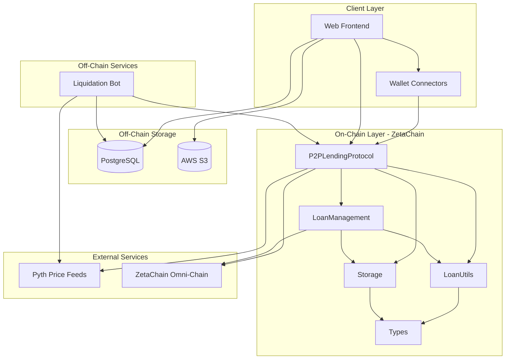
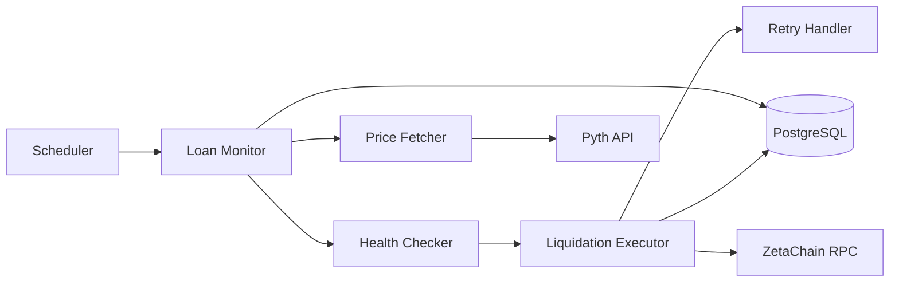
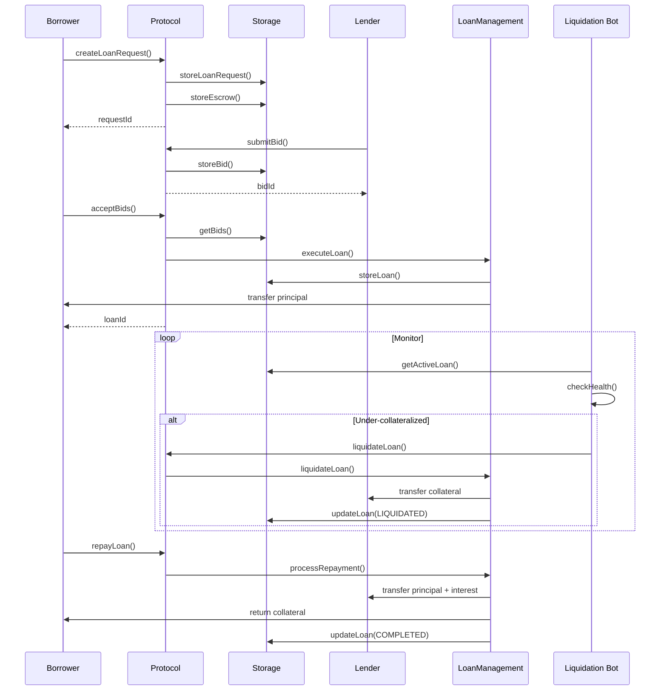
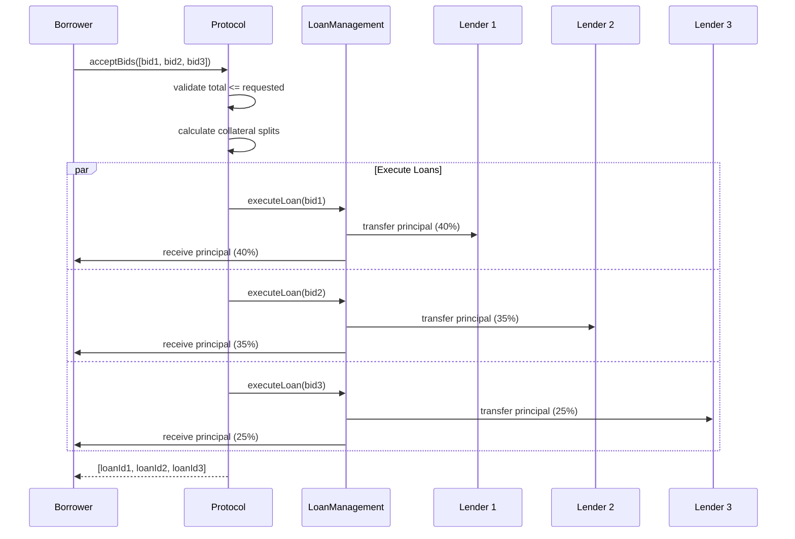

# Design Document

## Overview

ZetaConfluence is a cross-chain peer-to-peer lending protocol built on ZetaChain that enables borrowers to request loans with one asset as collateral and receive another asset as principal. The system uses a bidding mechanism where lenders compete to fund loans, and includes automated liquidation monitoring to protect lender capital. The architecture is divided into three layers: on-chain smart contracts, off-chain services, and client applications.

### Key Design Principles

1. **Modularity**: Separate concerns across contracts (protocol logic, storage, utilities, types)
2. **Upgradeability**: Isolate state in Storage contract to enable protocol upgrades
3. **Cross-chain compatibility**: Leverage ZetaChain's omni-chain capabilities for multi-chain assets
4. **Automated risk management**: Off-chain bot monitors and executes liquidations
5. **Flexible lending**: Support multiple bids per loan request for aggregated funding

## Architecture

### System Architecture Diagram



### Layer Responsibilities

**On-Chain Smart Contracts**
- Core protocol logic and state transitions
- Collateral escrow and loan execution
- Bid management and acceptance
- Repayment processing
- Liquidation validation and execution

**Off-Chain Services**
- Continuous monitoring of active loans
- Price feed queries and health checks
- Automated liquidation transaction submission
- State persistence and recovery

**Client Applications**
- User interface for borrowers and lenders
- Wallet integration and transaction signing
- Real-time data display and updates
- Cross-chain asset metadata management

## Components and Interfaces

### 1. P2PLendingProtocol Contract

**Purpose**: Main entry point for all user interactions with the protocol.

**Key Functions**:

```solidity
function createLoanRequest(
    address collateralAsset,
    uint256 collateralAmount,
    address principalAsset,
    uint256 principalAmount,
    uint256 duration,
    uint256 chainId
) external returns (uint256 requestId)
```
- Validates input parameters
- Creates escrow for collateral
- Stores loan request in Storage contract
- Emits LoanRequestCreated event

```solidity
function submitBid(
    uint256 requestId,
    uint256 amount,
    uint256 interestRate
) external returns (uint256 bidId)
```
- Validates bid parameters
- Stores bid in Storage contract
- Associates bid with loan request
- Emits BidSubmitted event

```solidity
function acceptBids(
    uint256 requestId,
    uint256[] calldata bidIds
) external
```
- Validates borrower ownership
- Validates total bid amounts
- Calls LoanManagement to execute loans
- Updates bid statuses to ACCEPTED
- Emits BidAccepted events

```solidity
function repayLoan(uint256 loanId) external payable
```
- Validates loan status is ACTIVE
- Validates repayment amount
- Calls LoanManagement to process repayment
- Emits LoanRepaid event

```solidity
function cancelLoanRequest(uint256 requestId) external
```
- Validates no bids accepted
- Returns collateral from escrow
- Updates request status to CANCELLED
- Emits LoanRequestCancelled event

**State Management**:
- Delegates all storage operations to Storage contract
- Maintains no local state except configuration

**Access Control**:
- Only borrower can accept bids or cancel their loan request
- Only borrower can repay their loan
- Anyone can submit bids
- Only authorized liquidators can trigger liquidations


### 2. LoanManagement Contract

**Purpose**: Manages loan lifecycle transitions and complex operations.

**Key Functions**:

```solidity
function executeLoan(
    uint256 requestId,
    uint256 bidId,
    address borrower,
    address lender
) external returns (uint256 loanId)
```
- Transfers collateral from escrow to loan
- Transfers principal from lender to borrower
- Creates active loan record
- Calculates maturity date and total owed
- Returns unique loan identifier

```solidity
function processRepayment(
    uint256 loanId,
    uint256 amount
) external
```
- Validates repayment amount matches total owed
- Transfers principal + interest to lender
- Returns collateral to borrower
- Updates loan status to COMPLETED

```solidity
function liquidateLoan(uint256 loanId) external
```
- Validates collateral ratio below threshold
- Transfers collateral to lender
- Updates loan status to LIQUIDATED
- Emits LoanLiquidated event

```solidity
function calculateInterest(
    uint256 principal,
    uint256 interestRate,
    uint256 duration
) public pure returns (uint256)
```
- Uses fixed-point arithmetic for precision
- Returns interest amount in principal asset units
- Supports rates up to 4 decimal places (basis points)

**Cross-Chain Operations**:
- Integrates with ZetaChain SDK for cross-chain transfers
- Handles asset bridging for collateral and principal
- Manages chain-specific transaction confirmations

### 3. LoanUtils Contract

**Purpose**: Reusable utility functions for calculations and validations.

**Key Functions**:

```solidity
function calculateCollateralRatio(
    address collateralAsset,
    uint256 collateralAmount,
    address principalAsset,
    uint256 principalAmount
) external view returns (uint256 ratio)
```
- Queries Pyth price feeds for both assets
- Normalizes decimals
- Returns ratio as fixed-point number (e.g., 1.5 = 150%)

```solidity
function validateCollateralRatio(
    uint256 ratio,
    uint256 minimumRatio
) external pure returns (bool)
```
- Compares calculated ratio against minimum
- Returns true if ratio meets or exceeds minimum

```solidity
function getPriceFromPyth(
    address asset
) external view returns (uint256 price, uint256 decimals)
```
- Queries Pyth oracle for asset price
- Returns price and decimal precision
- Reverts if price feed unavailable

```solidity
function normalizeAmount(
    uint256 amount,
    uint256 fromDecimals,
    uint256 toDecimals
) external pure returns (uint256)
```
- Converts amounts between different decimal precisions
- Prevents overflow/underflow
- Used for cross-asset calculations

**Integration with Pyth**:
- Uses pyth-sdk-solidity library
- Caches price feed IDs for supported assets
- Implements staleness checks for price data

### 4. Storage Contract

**Purpose**: Persistent storage for all protocol state.

**Data Structures**:

```solidity
struct LoanRequest {
    uint256 id;
    address borrower;
    address collateralAsset;
    uint256 collateralAmount;
    address principalAsset;
    uint256 principalAmount;
    uint256 duration;
    uint256 chainId;
    LoanRequestStatus status;
    uint256 createdAt;
}

struct Loan {
    uint256 id;
    uint256 requestId;
    uint256 bidId;
    address borrower;
    address lender;
    address collateralAsset;
    uint256 collateralAmount;
    address principalAsset;
    uint256 principalAmount;
    uint256 interestRate;
    uint256 totalOwed;
    uint256 startTime;
    uint256 maturityDate;
    LoanStatus status;
}

struct Bid {
    uint256 id;
    uint256 requestId;
    address lender;
    uint256 amount;
    uint256 interestRate;
    BidStatus status;
    uint256 createdAt;
}

struct Escrow {
    uint256 requestId;
    address asset;
    uint256 amount;
    bool released;
}
```

**Storage Functions**:
- `storeLoanRequest()`: Persists new loan request
- `updateLoanRequest()`: Updates request status
- `getLoanRequest()`: Retrieves request by ID
- `storeLoan()`: Persists new loan
- `updateLoan()`: Updates loan status and amounts
- `getLoan()`: Retrieves loan by ID
- `storeBid()`: Persists new bid
- `updateBid()`: Updates bid status
- `getBid()`: Retrieves bid by ID
- `getBidsByRequest()`: Returns all bids for a request
- `storeEscrow()`: Creates escrow entry
- `releaseEscrow()`: Marks escrow as released

**Access Control**:
- Only authorized protocol contracts can write
- Read functions are public
- Owner can authorize new protocol contracts

### 5. Types Contract

**Purpose**: Centralized type definitions for consistency.

**Enums**:

```solidity
enum LoanRequestStatus {
    PENDING,
    ACTIVE,
    CANCELLED,
    FULFILLED
}

enum LoanStatus {
    ACTIVE,
    COMPLETED,
    LIQUIDATED,
    DEFAULTED
}

enum BidStatus {
    PENDING,
    ACCEPTED,
    REJECTED,
    CANCELLED
}
```

**Events**:

```solidity
event LoanRequestCreated(
    uint256 indexed requestId,
    address indexed borrower,
    address collateralAsset,
    uint256 collateralAmount,
    address principalAsset,
    uint256 principalAmount
);

event BidSubmitted(
    uint256 indexed bidId,
    uint256 indexed requestId,
    address indexed lender,
    uint256 amount,
    uint256 interestRate
);

event BidAccepted(
    uint256 indexed bidId,
    uint256 indexed loanId
);

event LoanRepaid(
    uint256 indexed loanId,
    uint256 amount
);

event LoanLiquidated(
    uint256 indexed loanId,
    uint256 collateralAmount
);
```


### 6. Liquidation Bot

**Purpose**: Off-chain service for automated liquidation monitoring and execution.

**Architecture**:



**Components**:

**Scheduler**:
- Runs monitoring loop every 30 seconds
- Triggers loan health checks
- Manages concurrent processing

**Loan Monitor**:
- Fetches all active loans from contract
- Maintains watch list in database
- Adds new loans to monitoring
- Removes completed/liquidated loans

**Price Fetcher**:
- Queries Pyth price feeds via HTTP API
- Caches prices with timestamps
- Handles rate limiting and retries

**Health Checker**:
- Calculates current collateral value
- Compares against principal owed
- Identifies under-collateralized loans
- Logs health check results

**Liquidation Executor**:
- Builds liquidation transaction
- Estimates gas and sets appropriate limits
- Submits transaction to ZetaChain
- Waits for confirmation

**Retry Handler**:
- Implements exponential backoff (5s, 15s, 45s)
- Tracks retry attempts per loan
- Alerts on max retries exceeded
- Prevents duplicate liquidations

**Database Schema**:

```sql
CREATE TABLE active_loans (
    loan_id BIGINT PRIMARY KEY,
    borrower VARCHAR(42) NOT NULL,
    lender VARCHAR(42) NOT NULL,
    collateral_asset VARCHAR(42) NOT NULL,
    collateral_amount NUMERIC(78, 0) NOT NULL,
    principal_asset VARCHAR(42) NOT NULL,
    principal_owed NUMERIC(78, 0) NOT NULL,
    liquidation_threshold NUMERIC(10, 4) NOT NULL,
    added_at TIMESTAMP DEFAULT NOW(),
    last_checked_at TIMESTAMP
);

CREATE TABLE price_snapshots (
    id SERIAL PRIMARY KEY,
    asset VARCHAR(42) NOT NULL,
    price NUMERIC(78, 18) NOT NULL,
    timestamp TIMESTAMP DEFAULT NOW()
);

CREATE TABLE liquidation_attempts (
    id SERIAL PRIMARY KEY,
    loan_id BIGINT NOT NULL,
    attempt_number INT NOT NULL,
    tx_hash VARCHAR(66),
    status VARCHAR(20) NOT NULL,
    error_message TEXT,
    attempted_at TIMESTAMP DEFAULT NOW()
);

CREATE INDEX idx_active_loans_last_checked ON active_loans(last_checked_at);
CREATE INDEX idx_price_snapshots_asset_time ON price_snapshots(asset, timestamp DESC);
CREATE INDEX idx_liquidation_attempts_loan ON liquidation_attempts(loan_id);
```

**Configuration**:

```typescript
interface BotConfig {
    rpcUrl: string;
    contractAddress: string;
    privateKey: string;
    pythEndpoint: string;
    checkInterval: number; // milliseconds
    liquidationThreshold: number; // e.g., 1.2 for 120%
    maxRetries: number;
    retryDelays: number[]; // [5000, 15000, 45000]
    gasLimit: number;
    gasPriceMultiplier: number;
}
```

### 7. Web Frontend

**Purpose**: User interface for interacting with the protocol.

**Technology Stack**:
- React with TypeScript
- ethers.js for contract interaction
- ZetaChain SDK for cross-chain operations
- TanStack Query for data fetching
- Wagmi for wallet connections

**Key Components**:

**LoanRequestList**:
- Displays all active loan requests
- Shows collateral/principal details
- Filters by asset type, amount, duration
- Allows lenders to view and bid

**BidSubmissionForm**:
- Input for bid amount and interest rate
- Validates against loan request parameters
- Shows estimated returns
- Submits bid transaction

**ActiveLoansView**:
- Shows user's active loans (as borrower or lender)
- Displays repayment status and deadlines
- Shows current collateral health
- Provides repayment interface

**LoanDetailsModal**:
- Detailed view of single loan
- Shows all bids and their status
- Displays transaction history
- Shows collateral ratio chart

**WalletConnector**:
- Supports MetaMask, Phantom, WalletConnect
- Displays connected address and balance
- Handles network switching
- Manages transaction signing

**Asset Metadata Service**:

```typescript
interface AssetMetadata {
    address: string;
    symbol: string;
    name: string;
    decimals: number;
    chainId: number;
    icon: string;
    pythPriceId: string;
}

class AssetService {
    private assets: Map<string, AssetMetadata>;
    
    getAsset(address: string): AssetMetadata;
    normalizeAmount(amount: bigint, asset: AssetMetadata): string;
    formatDisplay(amount: bigint, asset: AssetMetadata): string;
}
```

**State Management**:
- React Context for wallet state
- TanStack Query for contract data
- Local storage for user preferences
- WebSocket for real-time updates (optional)

## Data Models

### Core Data Flow



### Multi-Bid Acceptance Flow




## Error Handling

### Smart Contract Error Handling

**Custom Errors** (Gas-efficient):

```solidity
error InsufficientCollateral(uint256 provided, uint256 required);
error UnauthorizedAccess(address caller, address required);
error InvalidLoanStatus(LoanStatus current, LoanStatus required);
error BidAlreadyAccepted(uint256 bidId);
error LoanNotLiquidatable(uint256 loanId, uint256 currentRatio, uint256 threshold);
error PriceFeedUnavailable(address asset);
error InvalidAmount(uint256 amount);
error LoanExpired(uint256 loanId, uint256 maturityDate);
```

**Validation Patterns**:

```solidity
modifier onlyBorrower(uint256 requestId) {
    LoanRequest memory request = storage.getLoanRequest(requestId);
    if (request.borrower != msg.sender) {
        revert UnauthorizedAccess(msg.sender, request.borrower);
    }
    _;
}

modifier validLoanStatus(uint256 loanId, LoanStatus required) {
    Loan memory loan = storage.getLoan(loanId);
    if (loan.status != required) {
        revert InvalidLoanStatus(loan.status, required);
    }
    _;
}
```

**Reentrancy Protection**:
- Use OpenZeppelin's ReentrancyGuard
- Apply to all functions with external calls
- Especially critical for repayment and liquidation

**Safe Math**:
- Use Solidity 0.8+ built-in overflow checks
- Explicit checks for division by zero
- Validate price feed data ranges

### Liquidation Bot Error Handling

**Transaction Failures**:
- Catch and log all transaction errors
- Implement exponential backoff retry
- Alert on max retries exceeded
- Store failed attempts in database

**Price Feed Failures**:
- Retry price queries up to 3 times
- Use cached prices if fresh data unavailable (max 5 minutes old)
- Skip health check if no valid price data
- Alert on extended price feed outages

**Database Failures**:
- Implement connection pooling with retry
- Use transactions for atomic operations
- Graceful degradation if DB unavailable
- In-memory fallback for critical operations

**Network Issues**:
- Detect RPC endpoint failures
- Failover to backup RPC endpoints
- Exponential backoff for connection retries
- Circuit breaker pattern for persistent failures

### Frontend Error Handling

**Transaction Errors**:
- Display user-friendly error messages
- Show transaction failure reasons
- Provide retry options
- Link to block explorer for details

**Wallet Errors**:
- Handle connection failures gracefully
- Prompt for network switching
- Detect insufficient balance
- Guide users through approval flows

**Data Loading Errors**:
- Show loading states
- Display error messages with retry
- Implement stale-while-revalidate pattern
- Graceful degradation for missing data

## Testing Strategy

### Smart Contract Testing

**Unit Tests** (Foundry/Hardhat):
- Test each function in isolation
- Mock external dependencies (Pyth, ZetaChain)
- Test all error conditions
- Verify event emissions
- Test access control

**Integration Tests**:
- Test complete user flows
- Test multi-contract interactions
- Test cross-chain scenarios (mocked)
- Test liquidation scenarios
- Test multi-bid acceptance

**Fuzz Testing**:
- Fuzz collateral/principal amounts
- Fuzz interest rates and durations
- Fuzz price feed values
- Test edge cases automatically

**Test Coverage Goals**:
- Minimum 90% line coverage
- 100% coverage for critical paths (liquidation, repayment)
- All error conditions tested

**Example Test Structure**:

```solidity
contract P2PLendingProtocolTest is Test {
    P2PLendingProtocol protocol;
    Storage storageContract;
    LoanManagement loanManagement;
    MockPyth pyth;
    
    function setUp() public {
        // Deploy contracts
        // Setup mock price feeds
        // Create test accounts
    }
    
    function testCreateLoanRequest() public {
        // Test successful loan request creation
    }
    
    function testCreateLoanRequest_InsufficientCollateral() public {
        // Test rejection with low collateral
    }
    
    function testAcceptMultipleBids() public {
        // Test multi-bid acceptance flow
    }
    
    function testLiquidation() public {
        // Test liquidation when under-collateralized
    }
}
```

### Liquidation Bot Testing

**Unit Tests** (Jest/Vitest):
- Test each component in isolation
- Mock contract calls
- Mock price feed responses
- Test retry logic
- Test database operations

**Integration Tests**:
- Test against local ZetaChain node
- Test with real contract deployments
- Test database persistence
- Test end-to-end liquidation flow

**Load Tests**:
- Test monitoring 1000+ active loans
- Test concurrent liquidation handling
- Test database query performance
- Measure memory usage over time

### Frontend Testing

**Component Tests** (React Testing Library):
- Test component rendering
- Test user interactions
- Test form validations
- Mock wallet connections
- Mock contract calls

**E2E Tests** (Playwright/Cypress):
- Test complete user flows
- Test wallet connection
- Test transaction submission
- Test error handling
- Test responsive design

**Visual Regression Tests**:
- Snapshot testing for UI components
- Test across different screen sizes
- Test dark/light themes

## Security Considerations

### Smart Contract Security

**Access Control**:
- Only borrower can accept bids for their loan
- Only borrower can repay their loan
- Only authorized contracts can write to Storage
- Only owner can update protocol configuration

**Reentrancy Protection**:
- Apply ReentrancyGuard to all external call functions
- Follow checks-effects-interactions pattern
- Use pull payment pattern where appropriate

**Integer Overflow/Underflow**:
- Rely on Solidity 0.8+ built-in checks
- Validate all arithmetic operations
- Use SafeMath for older Solidity versions

**Price Oracle Manipulation**:
- Use Pyth's time-weighted average prices
- Implement staleness checks
- Require minimum update frequency
- Consider multiple oracle sources for critical operations

**Flash Loan Attacks**:
- Implement time delays for critical operations
- Require collateral to be locked for minimum duration
- Use block.timestamp carefully (aware of miner manipulation)

**Front-Running**:
- Consider commit-reveal schemes for sensitive operations
- Use private mempools for liquidations (optional)
- Implement slippage protection

### Liquidation Bot Security

**Private Key Management**:
- Store private keys in secure key management system (AWS KMS, HashiCorp Vault)
- Never log or expose private keys
- Use separate keys for different environments
- Implement key rotation

**Transaction Security**:
- Validate all transaction parameters
- Set reasonable gas limits
- Implement nonce management
- Monitor for stuck transactions

**Database Security**:
- Use parameterized queries to prevent SQL injection
- Encrypt sensitive data at rest
- Use SSL/TLS for database connections
- Implement role-based access control

**API Security**:
- Rate limit external API calls
- Validate all external data
- Use HTTPS for all external communications
- Implement request signing where available

### Frontend Security

**Wallet Security**:
- Never request private keys
- Validate all user inputs
- Implement transaction preview
- Warn users about suspicious transactions

**XSS Protection**:
- Sanitize all user inputs
- Use React's built-in XSS protection
- Implement Content Security Policy
- Validate all external data

**CSRF Protection**:
- Use SameSite cookies
- Implement CSRF tokens for sensitive operations
- Validate origin headers

## Deployment Strategy

### Smart Contract Deployment

**Deployment Order**:
1. Deploy Types contract
2. Deploy Storage contract
3. Deploy LoanUtils contract
4. Deploy LoanManagement contract
5. Deploy P2PLendingProtocol contract
6. Configure contract addresses and permissions

**Verification**:
- Verify all contracts on block explorer
- Publish source code
- Document constructor parameters

**Initialization**:
- Set Pyth oracle address
- Configure liquidation threshold
- Set minimum collateral ratio
- Authorize protocol contracts in Storage

### Liquidation Bot Deployment

**Infrastructure**:
- Deploy on reliable cloud provider (AWS, GCP, Azure)
- Use containerization (Docker)
- Implement health checks
- Set up monitoring and alerting

**Database Setup**:
- Provision PostgreSQL instance
- Run migration scripts
- Set up backups
- Configure connection pooling

**Configuration**:
- Set environment variables
- Configure RPC endpoints
- Set monitoring intervals
- Configure alert thresholds

### Frontend Deployment

**Build Process**:
- Optimize bundle size
- Enable code splitting
- Implement lazy loading
- Generate source maps

**Hosting**:
- Deploy to CDN (Vercel, Netlify, Cloudflare)
- Enable HTTPS
- Configure caching headers
- Set up custom domain

**Monitoring**:
- Implement error tracking (Sentry)
- Set up analytics
- Monitor performance metrics
- Track user flows

## Performance Optimization

### Smart Contract Optimization

**Gas Optimization**:
- Use custom errors instead of require strings
- Pack struct variables efficiently
- Use calldata instead of memory where possible
- Batch operations when feasible
- Cache storage reads in memory

**Storage Optimization**:
- Use mappings instead of arrays for lookups
- Delete unused storage to get gas refunds
- Use events for historical data instead of storage

### Liquidation Bot Optimization

**Monitoring Efficiency**:
- Batch loan health checks
- Cache price data with TTL
- Use database indexes for fast queries
- Implement connection pooling

**Transaction Optimization**:
- Estimate gas accurately
- Use appropriate gas price strategies
- Batch liquidations when possible
- Implement transaction queuing

### Frontend Optimization

**Loading Performance**:
- Implement code splitting
- Lazy load components
- Optimize images and assets
- Use service workers for caching

**Data Fetching**:
- Implement pagination for large lists
- Use stale-while-revalidate pattern
- Cache contract data appropriately
- Batch RPC calls

**Rendering Performance**:
- Use React.memo for expensive components
- Implement virtual scrolling for long lists
- Debounce user inputs
- Optimize re-renders

## Monitoring and Observability

### Smart Contract Monitoring

**Event Monitoring**:
- Index all protocol events
- Set up alerts for critical events
- Track transaction volumes
- Monitor gas usage

**Metrics**:
- Total value locked (TVL)
- Number of active loans
- Liquidation rate
- Average interest rates
- Protocol revenue

### Liquidation Bot Monitoring

**Health Metrics**:
- Bot uptime
- Monitoring loop latency
- Transaction success rate
- Database query performance

**Alerts**:
- Bot downtime
- Failed liquidations
- Price feed failures
- Database connection issues
- High gas prices

### Frontend Monitoring

**Performance Metrics**:
- Page load time
- Time to interactive
- Core Web Vitals
- API response times

**Error Tracking**:
- JavaScript errors
- Failed transactions
- Wallet connection issues
- API failures

**User Analytics**:
- User flows
- Conversion rates
- Feature usage
- Bounce rates
