<div align="center" width="80%">


# ZetaConfluence

### Cross-Chain P2P Lending Protocol

[](https://opensource.org/licenses/MIT)
[](https://www.zetachain.com/)
[](https://pyth.network/)

*Borrow and lend across blockchains with competitive rates and automated security*

[Documentation](#) • [Discord](#) • [Twitter](#) • [Website](https://zetaconfluence.speedballmag.com/)

</div>

---

## 🌐 What is ZetaConfluence?

ZetaConfluence is a decentralized lending platform that solves a key problem in DeFi: accessing liquidity across different blockchain networks. Unlike traditional lending protocols that limit you to assets on a single chain, ZetaConfluence lets you use Bitcoin as collateral to borrow Ethereum, or lock up Solana tokens to receive USDC on Polygon—all through a single, unified protocol.

The platform uses a competitive bidding mechanism where lenders propose their own interest rates, creating a dynamic marketplace that benefits both borrowers seeking the best rates and lenders looking for attractive returns.

```mermaid
graph LR
    A[🪙 Bitcoin] -->|Collateral| B[ZetaConfluence]
    C[💎 Ethereum] -->|Collateral| B
    D[⚡ Solana] -->|Collateral| B
    B -->|Borrow| E[💵 USDC]
    B -->|Borrow| F[💎 ETH]
    B -->|Borrow| G[🪙 BTC]
    style B fill:#7C3AED,stroke:#5B21B6,stroke-width:3px,color:#fff
```

<div align="center">



</div>

## 🔄 How It Works

<table>
<tr>
<td width="50%">

### 👤 For Borrowers

1. **📝 Create a Loan Request**  
   Specify collateral asset, desired asset, and loan duration

2. **👀 Review Bids**  
   Lenders compete with different interest rates and amounts

3. **✅ Accept Bids**  
   Choose one or multiple bids that meet your needs

4. **💰 Receive Funds**  
   Get borrowed assets instantly, collateral held securely

5. **🔄 Repay**  
   Return principal + interest to reclaim collateral

</td>
<td width="50%">

### 💼 For Lenders

1. **🔍 Browse Loan Requests**  
   See opportunities across different assets and chains

2. **📊 Submit Bids**  
   Propose your interest rate and lending amount

3. **📈 Earn Interest**  
   Receive returns when borrowers repay

4. **🛡️ Protected Capital**  
   Automated liquidation protects against collateral drops

</td>
</tr>
</table>

## ✨ Key Features

<div align="center">

| Feature | Description |
|---------|-------------|
| 🌉 **Cross-Chain Flexibility** | Use assets from Bitcoin, Ethereum, Solana, Polygon, and more as collateral or principal |
| 💹 **Competitive Bidding** | Market-driven interest rates through lender competition |
| 🤖 **Automated Risk Management** | Continuous monitoring and auto-liquidation of under-collateralized loans |
| 🤝 **Multi-Lender Support** | Aggregate funding from multiple lenders for flexible loan structuring |
| 🔒 **Transparent & Secure** | On-chain records with smart contract automation—no intermediaries |

</div>

## 💡 Use Cases

<div align="center">


</div>

### 🔗 Cross-Chain Liquidity Access
Hold Bitcoin but need USDC for a DeFi opportunity on Ethereum? Use your BTC as collateral to borrow USDC without selling your Bitcoin position.

### 📊 Yield Generation
Lenders can deploy idle capital across multiple chains and asset types, earning interest by funding loan requests that match their risk appetite.

### 💎 Leverage Without Selling
Maintain exposure to your favorite assets while accessing liquidity for other opportunities, trading, or expenses.

### ⚡ Arbitrage and Trading
Traders can access capital in specific assets on specific chains to take advantage of market opportunities without complex bridging.

## 🏗️ Project Structure

<div align="center">


</div>

### ⛓️ On-Chain Smart Contracts
The core protocol logic deployed on ZetaChain:

- **P2PLendingProtocol**: Main entry point for user interactions
- **LoanManagement**: Handles loan lifecycle operations
- **Storage**: Centralized data storage (upgradeable architecture)
- **LoanUtils**: Utility functions for calculations and validations
- **Types**: Shared type definitions and enums

### 🤖 Off-Chain Services
Automated monitoring and execution:

- **Liquidation Bot**: Monitors loans and triggers liquidations
- **PostgreSQL Database**: Persists state, prices, and history
- **Price Feed Integration**: Queries Pyth Network for real-time prices

### 🎨 Client Applications
User-facing interfaces:

- **Web Frontend**: React-based application for all user interactions
- **Wallet Integration**: MetaMask, Phantom, WalletConnect support
- **Asset Metadata Service**: Cross-chain asset information management

## 🛠️ Technology Stack

<div align="center">

### Blockchain & Smart Contracts

[](https://www.zetachain.com/)
[](https://soliditylang.org/)
[](https://getfoundry.sh/)
[](https://hardhat.org/)

### Price Oracles

[](https://pyth.network/)

### Backend Services

[](https://www.typescriptlang.org/)
[](https://nodejs.org/)
[](https://www.postgresql.org/)

### Frontend

[](https://react.dev/)
[](https://www.typescriptlang.org/)
[](https://vitejs.dev/)
[](https://docs.ethers.org/)
[](https://wagmi.sh/)
[](https://tanstack.com/query)

### Infrastructure

[](https://www.docker.com/)
[](https://aws.amazon.com/)
[](https://vercel.com/)

</div>

## 🏛️ Architecture Overview

```mermaid
sequenceDiagram
    participant 👤 Borrower
    participant 🎨 Frontend
    participant ⛓️ Protocol
    participant 💼 Lender
    participant 🤖 Bot
    participant 📊 Pyth
    
    👤 Borrower->>🎨 Frontend: Create Loan Request
    🎨 Frontend->>⛓️ Protocol: Submit with Collateral
    ⛓️ Protocol->>⛓️ Protocol: Lock Collateral in Escrow
    ⛓️ Protocol-->>👤 Borrower: Request ID
    
    💼 Lender->>🎨 Frontend: Browse Requests
    💼 Lender->>⛓️ Protocol: Submit Bid (Amount + Rate)
    ⛓️ Protocol-->>💼 Lender: Bid ID
    
    👤 Borrower->>⛓️ Protocol: Accept Bid(s)
    ⛓️ Protocol->>💼 Lender: Transfer Principal
    ⛓️ Protocol->>👤 Borrower: Receive Principal
    ⛓️ Protocol->>⛓️ Protocol: Activate Loan
    
    loop Continuous Monitoring
        🤖 Bot->>📊 Pyth: Get Asset Prices
        📊 Pyth-->>🤖 Bot: Current Prices
        🤖 Bot->>🤖 Bot: Calculate Health Ratio
        alt Under-collateralized
            🤖 Bot->>⛓️ Protocol: Trigger Liquidation
            ⛓️ Protocol->>💼 Lender: Transfer Collateral
        end
    end
    
    👤 Borrower->>⛓️ Protocol: Repay Loan + Interest
    ⛓️ Protocol->>💼 Lender: Transfer Payment
    ⛓️ Protocol->>👤 Borrower: Return Collateral
```

<div align="center">



</div>

## 🚀 Getting Started

### Prerequisites

<div align="center">

| Tool | Version | Purpose |
|------|---------|---------|
|  | v18+ | Runtime environment |
|  | Latest | Package manager |
|  | Latest | Smart contract development |
|  | v15+ | Database for liquidation bot |

</div>

### 📦 Installation

```bash
# Clone the repository
git clone https://github.com/yourusername/zetaconfluence.git
cd zetaconfluence

# Install dependencies
yarn install

# Install frontend dependencies
cd frontend
yarn install
cd ..
```

### ⛓️ Smart Contract Development

```bash
# Compile contracts
forge build

# Run tests
forge test

# Run tests with coverage
forge coverage

# Deploy to testnet
yarn deploy:testnet
```

### 🎨 Running the Frontend

```bash
cd frontend
yarn dev
```

The application will be available at `http://localhost:5173` 🌐

### 🤖 Running the Liquidation Bot

```bash
# Set up environment variables
cp .env.example .env
# Edit .env with your configuration

# Run database migrations
yarn migrate

# Start the bot
yarn start:bot
```

## 🔐 Security

<div align="center">


</div>

ZetaConfluence implements multiple layers of security:

- 🛡️ **Smart Contract Audits**: All contracts undergo thorough testing and auditing
- 🤖 **Automated Liquidations**: Protect lender capital from collateral value drops
- 🔒 **Access Controls**: Strict permissions ensure only authorized actions
- 🚫 **Reentrancy Protection**: Guards against common attack vectors
- 📊 **Oracle Security**: Uses Pyth Network's secure price feeds with staleness checks

## 🤝 Contributing

We welcome contributions from the community! Whether it's bug reports, feature requests, or code contributions, we appreciate your help in making ZetaConfluence better.

<div align="center">

[](https://github.com/yourusername/zetaconfluence/graphs/contributors)
[](https://github.com/yourusername/zetaconfluence/issues)
[](https://github.com/yourusername/zetaconfluence/pulls)

</div>

Please see our [Contributing Guidelines](CONTRIBUTING.md) for more information.

## 📄 License

This project is licensed under the MIT License - see the [LICENSE](LICENSE) file for details.

## 🔗 Links & Community

<div align="center">

[](https://docs.zetaconfluence.io)
[](https://discord.gg/zetaconfluence)
[](https://twitter.com/zetaconfluence)
[](https://zetaconfluence.io)

</div>

## 🙏 Acknowledgments

Built with support from:

<div align="center">

| Partner | Contribution |
|---------|-------------|
|  | Omni-chain infrastructure |
|  | Reliable price feeds |
|  | Inspiration and feedback |

</div>

---

<div align="center">

### ⚠️ Disclaimer

**ZetaConfluence is experimental software. Use at your own risk.**

Always do your own research before participating in DeFi protocols.  
Never invest more than you can afford to lose.

---

Made with 💜 by the ZetaConfluence Team

[](https://github.com/yourusername/zetaconfluence)
[](https://twitter.com/zetaconfluence)

</div>
